# Verificador CPF

Sistema acadêmico desenvolvido em **Java + JavaFX** com foco em **indexação de dados utilizando Árvore Binária de Busca (BST)** para armazenar e consultar registros de contribuintes por CPF.

O projeto foi criado para demonstrar, na prática, como estruturas de dados impactam desempenho, organização e escalabilidade.

---

# 📸 Visão Geral do Sistema

## Menu principal

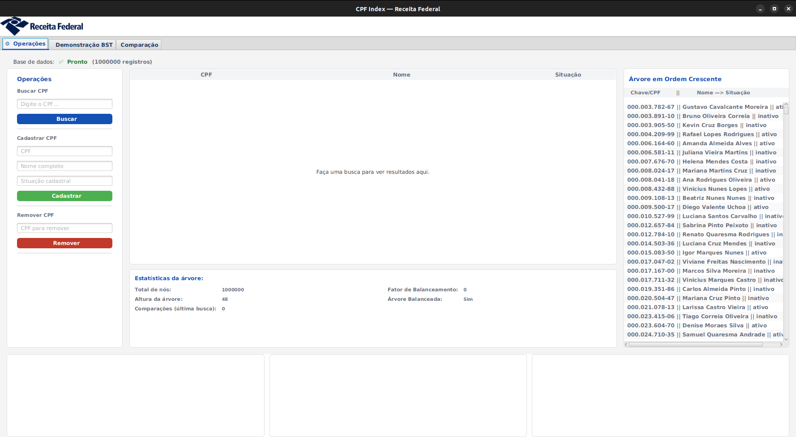

## Operações sobre os dados

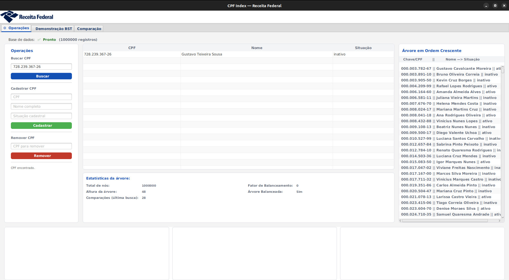

## Demonstração da árvore

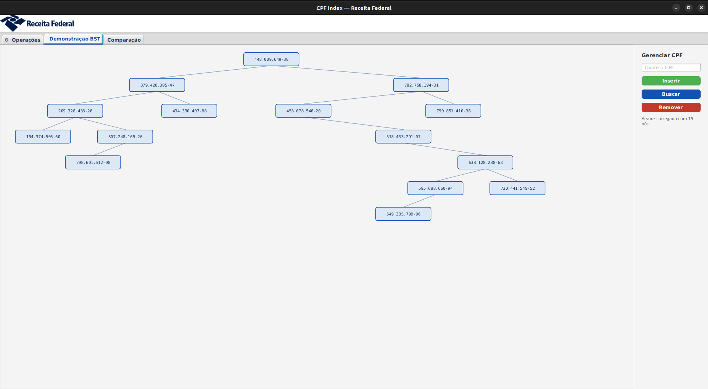

## Comparação entre abordagens

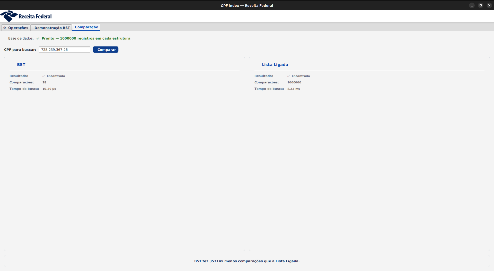

---

# 🎯 Objetivos do Projeto

- Demonstrar uso prático de BST
- Comparar busca linear vs busca indexada
- Trabalhar arquitetura MVC
- Manipular grandes massas de dados
- Visualizar estruturas de dados graficamente
- Aplicar conceitos de persistência e organização de software

---

# 🏛 Arquitetura do Projeto

O projeto segue o padrão **MVC (Model-View-Controller)**.

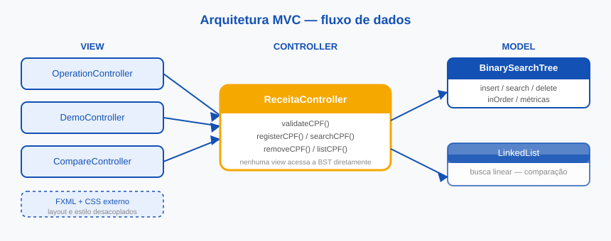

## Estrutura real do projeto

```text
verificador-cpf/
├── src/
│   ├── main/
│   │   ├── java/
│   │   │   ├── com/cpfindex/
│   │   │   │   └── Main.java
│   │   │   ├── controller/
│   │   │   ├── model/
│   │   │   └── view/
│   │   └── resources/
│   │       ├── css/
│   │       ├── fxml/
│   │       └── images/
├── gradle/
├── build.gradle
├── settings.gradle
└── imagens/
```

---

# 🧠 Estruturas de Dados Utilizadas

## Árvore Binária de Busca (BST)

Estrutura principal usada para indexação dos CPFs.

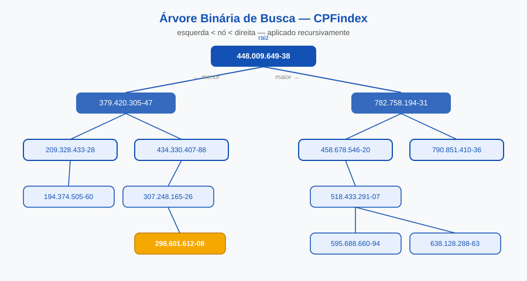

Operações implementadas:

- Inserção
- Busca
- Remoção
- Percursos
- Navegação visual

### Inserção

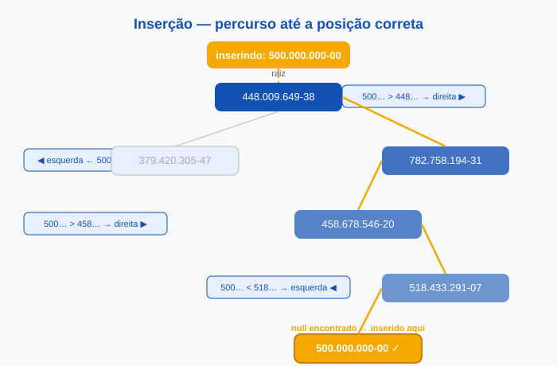

### Busca

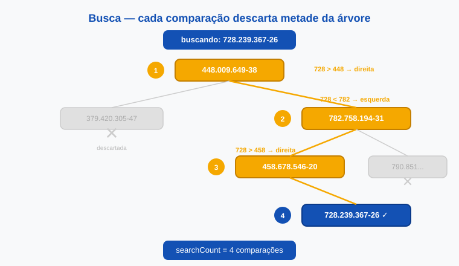

### Remoção

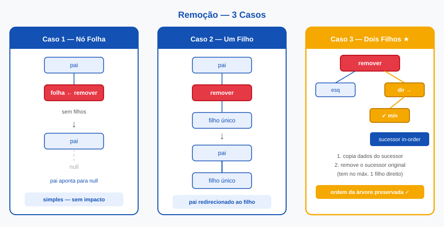

### Percursos

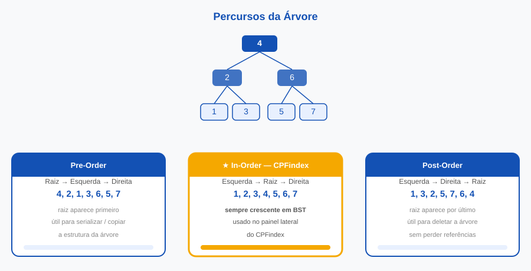

---

# 📊 Comparação de Estratégias

O sistema permite comparar:

- Busca linear
- Busca indexada por árvore

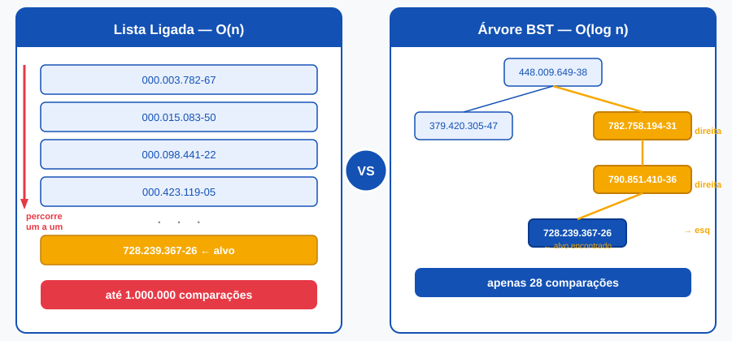

Objetivo:

Avaliar o ganho de desempenho obtido pela indexação.

---

# 📦 Componentes Principais

## Model

| Classe | Função |
|------|------|
| BinarySearchTree | Implementação da BST |
| NodeBst | Nó da árvore |
| NodeBstVisual | Nó visual |
| LinkedList | Estrutura auxiliar |
| NodeLkdList | Nó auxiliar |
| Contribuinte | Entidade principal |
| CpfRepository | Persistência e gerenciamento |

## Controller

| Classe | Função |
|------|------|
| ReceitaController | Regras de negócio |
| DataGeneratorControler | Geração/carregamento de dados |

## View

| Classe | Função |
|------|------|
| MenuView | Navegação |
| OperationController | Operações CRUD |
| DemoController | Demonstrações |
| CompareController | Comparações |
| RelatorioView | Relatórios |
| TreePane | Renderização gráfica |

---

# ⚙️ Requisitos

- Java 17+
- Gradle
- JavaFX

---

# ▶️ Como Executar

## Clonar o projeto

```bash
git clone <URL_DO_REPOSITORIO>
cd verificador-cpf
```

## Linux / Mac

```bash
./gradlew run
```

## Windows

```bash
gradlew.bat run
```

## Gerar build

```bash
./gradlew build
```

## Executar testes

```bash
./gradlew test
```

---

# 🚀 Melhorias Futuras

- AVL / Red-Black Tree
- Benchmarks automáticos
- Exportação de relatórios
- Persistência em banco
- Métricas de desempenho

---

# 👨‍💻 Contexto Acadêmico

Projeto voltado ao estudo de:

- Estruturas de dados
- Complexidade algorítmica
- Arquitetura MVC
- Organização de software
- Sistemas indexados
